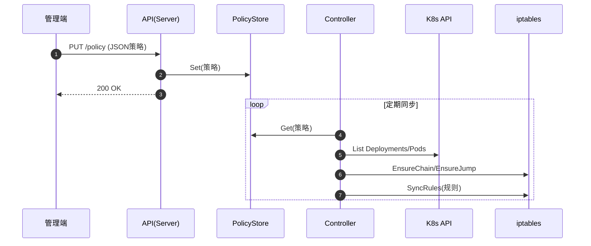
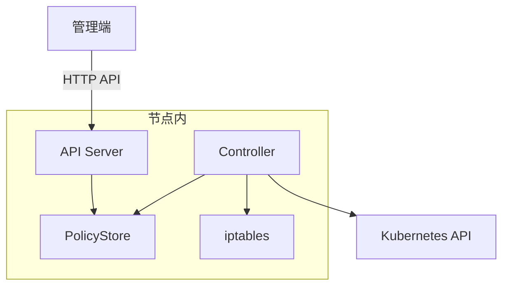
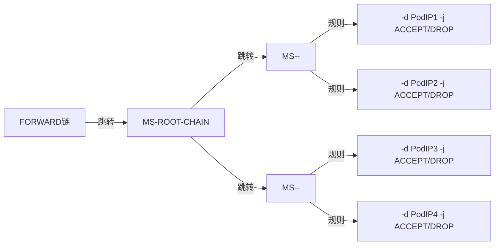

# 设计思路与架构说明

本文档详细说明本程序的设计目标、核心架构、各模块/文件的职责，以及它们之间的交互流程。面向不熟悉系统的人，尽量用通俗的方式描述。

## 1. 设计目标与总体思路

业务目标是在 CCE 集群节点上实现对各 `Deployment` 的网络访问控制。核心思路如下：

1. **节点本地执行**：以 DaemonSet 的方式在每个节点运行一个实例，直接在节点上维护 iptables 规则。
2. **定期同步**：周期性从 Kubernetes API 获取 `Deployment` 与本节点 `Pod` 状态，保证策略与实际运行状态一致。
3. **外部管理接口**：提供内置 HTTP API，管理端通过接口下发策略（不依赖 ConfigMap）。
4. **CNI 兼容**：使用自定义链并尽量避免破坏 Calico 规则优先级。

## 1.1 快速上手（给新对话的最短路径）

如果你是第一次接手该项目，请按以下路径快速建立全局认知：

1. 阅读本文件：
  - 了解核心模块与交互流程。
2. 阅读 [README.md](../README.md)：
  - 了解安装、配置与运行方式。
3. 阅读 [docs/TESTING.md](../docs/TESTING.md)：
  - 了解可复现测试步骤与预期结果。
4. 关注关键入口文件：
  - [cmd/controller/main.go](../cmd/controller/main.go)
  - [internal/controller/controller.go](../internal/controller/controller.go)
  - [internal/controller/api.go](../internal/controller/api.go)

## 1.2 关键配置速览（必须掌握）

核心环境变量：
- `NODE_NAME`：当前节点名（DaemonSet 自动注入）。
- `API_BIND`：管理 API 监听地址（默认 `:18080`）。
- `API_TOKEN`：可选 API 访问令牌。
- `POLICY_FILE`：可选策略持久化路径。
- `FORWARD_JUMP_POSITION`：`insert`/`append`，决定规则优先级（默认 `insert`）。

## 1.3 关键约束与默认行为

1. **规则优先级**：
  - 默认 `insert`，可确保策略优先匹配。
  - 若担心影响 CNI，可切回 `append`。
2. **策略生效范围**：
  - 目前通过 Pod IP（目的地址）控制流量。
3. **策略存储**：
  - 默认仅内存；如需持久化使用 `POLICY_FILE`。

## 2. 架构总览

主要模块：

1. **控制器（Controller）**：核心同步逻辑，负责把集群状态和策略转成 iptables 规则。
2. **iptables 适配层**：封装 `iptables` 命令执行，提供链创建、跳转和规则同步能力。
3. **策略存储（PolicyStore）**：保存当前生效的策略；可选持久化到文件。
4. **HTTP API 服务**：对外提供 `GET /policy` 和 `PUT /policy` 接口，用于管理端下发/读取策略。
5. **Kubernetes Client**：访问集群 API，读取 `Deployment` 与本节点 `Pod`。

## 3. 核心运行流程

### 3.1 启动阶段

1. 主程序启动后读取环境变量（如 `NODE_NAME`、`API_BIND`、`API_TOKEN`、`POLICY_FILE`）。
2. 初始化 Kubernetes 客户端。
3. 初始化 `PolicyStore` 并启动 HTTP API 服务器。
4. 进入周期性同步循环，定期调用 `Sync()`。

### 3.2 同步阶段（Sync）

1. **读取集群状态**：获取所有 `Deployment` 的标签选择器，并查询本节点上的 `Pod` 列表。
2. **关联关系映射**：将 `Pod` 归属到对应的 `Deployment`，收集每个 `Deployment` 在本节点上的 Pod IP 列表。
3. **读取策略**：从 `PolicyStore` 获取当前策略配置。
4. **规则生成**：为每个 `Deployment` 生成独立链规则（目标为对应 Pod IP），应用策略动作。
5. **规则下发**：确保根链与跳转规则存在，并把每个 `Deployment` 的规则同步到其专用链。

## 4. 关键设计点说明

### 4.1 与 Calico 的兼容

本程序使用自定义链（前缀 `MS`）。默认将跳转插入到 `FORWARD` 链首（`insert`），保证策略优先生效；
如需减少对 CNI 的影响，可切换为 `append`。在生产中建议通过灰度观察后决定。

### 4.2 高可用与扩展

- 通过 DaemonSet 保证每个节点都有实例在运行，节点故障会自动恢复。
- 同步机制会自动适配新增/删除节点与 Pod 的变化。

### 4.3 策略下发与管理

内置 HTTP API 简化了外部管理端对策略的控制：

- `GET /policy`：查询当前策略。
- `PUT /policy`：更新策略并立即生效（下一个同步周期内应用）。

可选 `API_TOKEN` 作为简单鉴权机制；可选 `POLICY_FILE` 用于策略持久化。

## 5. 文件与目录结构说明

以下为关键文件与作用：

### 5.1 程序入口

- [cmd/controller/main.go](../cmd/controller/main.go)
  - 启动程序、读取环境变量、初始化依赖（Kubernetes 客户端、策略存储、HTTP API）。
  - 启动 HTTP 管理接口并进入周期性 `Sync` 循环。

### 5.2 控制器逻辑

- [internal/controller/controller.go](../internal/controller/controller.go)
  - `Controller` 结构体与核心同步流程 `Sync()`。
  - 将集群状态与策略转为 iptables 规则，并下发到节点。

- [internal/controller/rules.go](../internal/controller/rules.go)
  - `buildRulesForDeployment()`：根据策略为指定 `Deployment` 生成规则。
  - `normalizeAction()`：将 `ALLOW/DENY` 归一化成 iptables 动作（`ACCEPT/DROP`）。

### 5.3 策略与 API

- [internal/controller/policy.go](../internal/controller/policy.go)
  - `PolicyConfig`、`DeploymentPolicy`、`Rule`：策略 JSON 定义。
  - `PolicyStore`：内存策略存储，可选文件持久化。

- [internal/controller/api.go](../internal/controller/api.go)
  - HTTP API 实现：`GET /policy` 和 `PUT /policy`。
  - 简单 Token 鉴权（`X-API-Token`）。

### 5.4 iptables 封装

- [internal/iptables/iptables.go](../internal/iptables/iptables.go)
  - `RunCommand()`：统一执行系统 `iptables` 命令。
  - `EnsureChain()`：保证链存在。
  - `EnsureJump()`：保证 FORWARD 链到根链的跳转（支持 `insert/append`）。
  - `SyncRules()`：清空并重建指定链的规则。
  - `MakeChainName()`：生成合法链名。

### 5.5 Kubernetes 客户端

- [internal/kube/client.go](../internal/kube/client.go)
  - `NewClient()`：优先使用 InClusterConfig，回退到本地 kubeconfig。

### 5.6 部署清单与文档

- [manifests/daemonset.yaml](../manifests/daemonset.yaml)
  - DaemonSet、ServiceAccount、RBAC、Service 等部署资源。

- [README.md](../README.md)
  - 安装、配置、调用示例与常见问题。

## 6. 模块交互关系（文字版）

1. 管理端通过 HTTP 调用 API（`/policy`）更新策略。
2. API 将策略写入 `PolicyStore`（内存/可选文件）。
3. 控制器周期性 `Sync()` 从 `PolicyStore` 读取策略。
4. 控制器读取 `Deployment` 与 `Pod` 状态并生成规则。
5. 通过 iptables 适配层下发规则到节点。

## 6.3 运行/开发工作流（新接手必读）

1. **构建镜像**（本地）：
  - `docker build -t ms-iptables:latest .`
2. **加载到 kind（如需本地测试）**：
  - `kind load docker-image ms-iptables:latest --name ms-dev`
3. **部署/更新**：
  - `kubectl apply -f manifests/daemonset.yaml`
4. **查看日志**：
  - `kubectl -n ms-iptables logs -l app=ms-iptables --tail=200`
5. **策略下发**：
  - `PUT /policy`（参见 README 与 TESTING 文档）

## 6.4 关键排错清单

1. **策略未生效**：
  - 检查 `FORWARD` 链中 `MS-ROOT-CHAIN` 是否在前面。
  - 检查 `MS-ROOT-CHAIN` 内是否包含目标专用链。
  - 检查专用链内规则是否包含期望条件（CIDR/端口）。
2. **API 不可访问**：
  - 检查 `ms-iptables-api` Service 是否存在。
  - 检查 Pod 内监听日志（`starting api server`）。
3. **策略丢失**：
  - 若需要重启持久化，请配置 `POLICY_FILE`。

## 6.1 交互流程图（Mermaid）

### 时序图

### 组件关系图

## 6.2 iptables 规则链路图（Mermaid）

以下示例展示本程序在节点上创建的链与规则的流向（简化表示）：

说明：
- `FORWARD` 链中会追加一条跳转到 `MS-ROOT-CHAIN` 的规则。
- 根链对每个 Deployment 专用链做跳转。
- 专用链内包含针对各 Pod IP 的规则，动作由策略决定（`ACCEPT/DROP/REJECT/RETURN`）。

## 8. 策略 JSON 校验规则说明

当前实现对策略的校验属于“轻量级”方式，主要规则如下：

1. **`defaultAction` 为空时**：会自动回退为 `ALLOW`。
2. **`action` 为空时**：会回退使用 `defaultAction`。
3. **`protocol` 为空但 `port` 非 0**：会记录日志提示，但仍会忽略端口（因为缺少协议无法生成 `--dport`）。
4. **`srcCIDR` 为空**：表示不限制来源地址。
5. **`port` 为 0**：表示不限制端口。

建议的规范：
- `action` 推荐使用 `ALLOW`/`DENY`，避免直接暴露 iptables 细节。
- `protocol` 推荐显式填写 `tcp/udp/icmp` 之一，避免端口规则不生效。

后续可扩展的严格校验方向：
- 校验 CIDR 格式是否合法。
- 校验端口范围（1-65535）。
- 校验 `action` 枚举值。

## 7. 可扩展方向

- 支持更复杂的策略（端口范围、方向、命名空间级默认规则）。
- 增加管理端统一广播机制（对所有节点实例下发策略）。
- 引入更强鉴权方式（JWT、mTLS）与审计日志。
